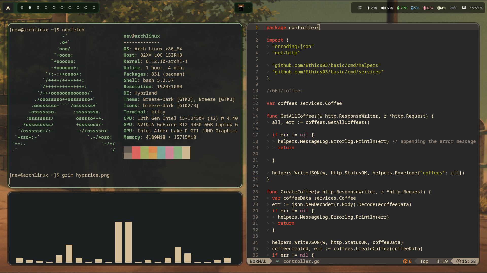
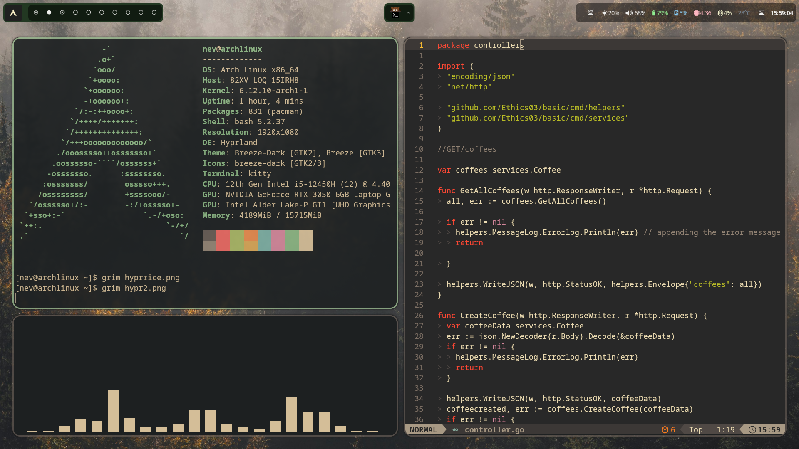
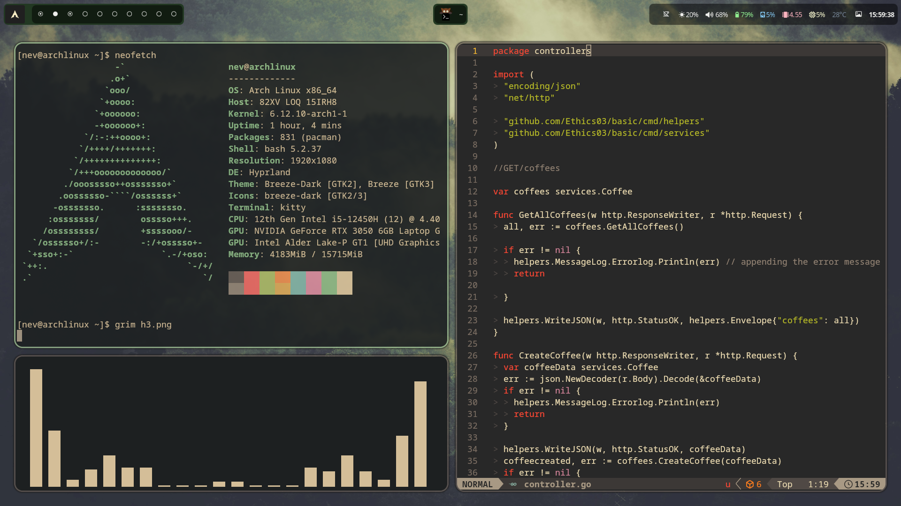

# Hyprland Configuration

Clone this repo with this command:

```bash
git clone https://github.com/Ethics03/Arch-Hyprland-Dotfiles.git
```

# Dependencies ->

```


waybar
hyprshot
hyprpaper
swaync
kitty
wofi
neofetch

```
Make sure you install all the packages before using the configuration

# Showcase -> 








